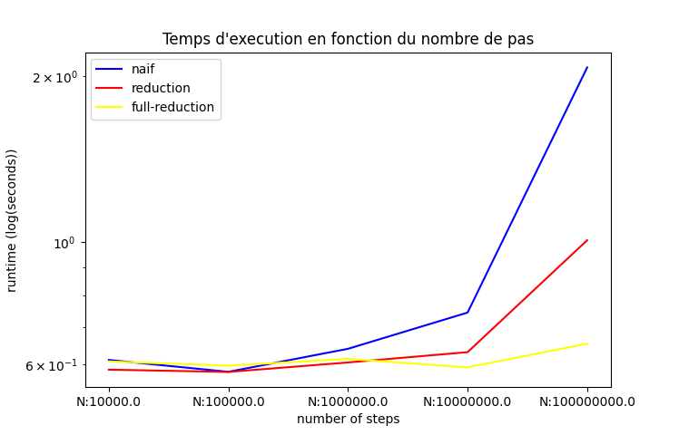
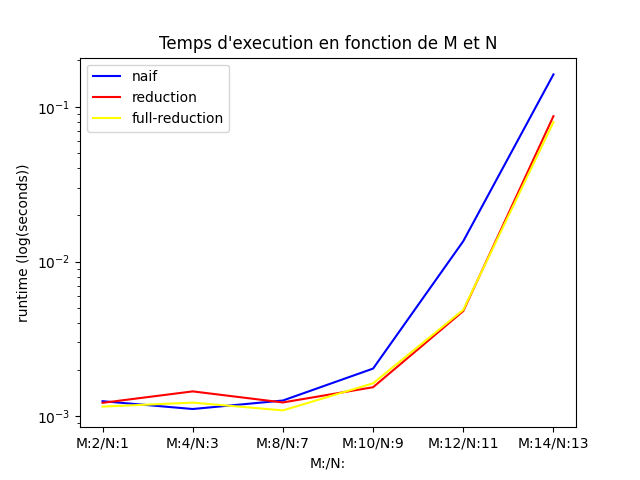

# OT5 : Calcul parallèl

## Membres
Mario CASTILLON  
Jorge KORGUT Junior


## Architecture du projet OpenMP


* Dans la racine nous avons un Makefile qui compile tous les exécutables des différentes parties.  
>Pour compiler les sources
    ```Make```  


* Les exécutables sont générés dans le dossier **/Executables**
* Pour accéder aux codes sources des parties, les dossiers **/Part#** sont disponibles dans la racine du projet. Pour les sources CUDA ils se trouvent sur le dossier **/Cuda**  
* Pour exécuter les scripts pythons d'analyses, veuillez exécuter dans la racine du projet :  


>Pour générer un fichier stats.csv avec les données d'exécution des programmes  
    ```python3 ./Analysis/Part1/evaluation.py```
    ```python3 ./Analysis/Part2/evaluation.py```
    ```python3 ./Analysis/Cuda/evaluation.py```  


>Pour afficher un graphe avec les données de performance  
    ```python3 ./Analysis/Part1/analysis.py```  
    ```python3 ./Analysis/Part2/analysis.py```
    ```python3 ./Analysis/Cuda/analysis.py```  


## Lien d'installation CUDA


>Install cuda SDK
https://developer.nvidia.com/cuda-downloads?target_os=Linux&target_arch=x86_64&Distribution=WSL-Ubuntu&target_version=2.0&target_type=deb_local


## Spécialisation de l'ordinateur utilisé pour les tests.


* **OS** : WSL2 dans Windows 10
* **GPU** : NVIDIA GeForce GTX 1050
* **CPU** : Intel(R) Core(TM) i7-7700HQ CPU @ 2.80GHz 2.81 GHz


## Introduction OpenMP


L'objectif de ce TP est d'utiliser concrètement les fonctionnalités de parallélisation de la librairie OPENMP, prendre en main les outils d'analyse de performance comme Intel VTune Profiler et de se familiariser avec quelques cas classiques de parallélisation d'algorithmes.  
Il est intéressant de remarquer que les parallélisations que nous effectuerons ici ne seront pas optimales. En effet, si nous prenons l'exemple de la deuxième partie, les multiplications et sommes des matrices peuvent être beaucoup plus optimisées si des librairies spécifiques faites pour ce type de calcul sont utilisées.  


Pour l'obtention des données de performance, chaque algorithme a été exécuté 10 fois pour chaque paramètre spécifique. Comme par exemple le nombre de threads, taille des matrices, nombre d'itérations.


## Partie 1  


Dans le domaine de l'informatique et de la programmation, la recherche de méthodes efficaces pour le calcul de constantes mathématiques revêt une importance cruciale. Parmi ces constantes, le nombre π occupe une place prépondérante en raison de son omniprésence dans de nombreuses disciplines scientifiques et techniques.


Pour le calculer nous avons repris le code de Tim Mattson qui a été modifié par Jonathan Rouzaud-Cornabas qui calcule une approximation de π par la résolution numérique de l'intégrale suivante :
$\int_0^1 \frac{4}{(1+x^{2})} dx$  


car :  
$\int_0^1 \frac{4}{(1+x^{2})} dx = 4*(arctg(1) - arctg(0)) = 4*(\frac{π}{4} - (0)) = π$


Il est intéressant de remarquer que la correction de notre calcul est donc possible grâce à la connaissance en amont du résultat. Ce qui facilite le débogage.


Dans le code fourni, il est facile d'identifier le point d'optimisation. En effet, comme l'algorithme consiste seulement d'une seule boucle et nous avons un algorithme en séquence, nous pouvons nous concentrer à essayer la parallélisation de cette boucle for.


En ajoutant le pragma suivant avant la boucle :
```c++
    #pragma omp parallel for num_threads(num_cores)
```
Nous spécifions à openMP que nous voudrions un certain numéro de threads.


De plus on rajoute les mots clefs :
```c++
    #pragma omp atomic
```
Pour éviter les cas de concurrence qui viennent attaquer nos résultats.


_Comparaison du temps d'exécution du programme en mode séquentiel et en mode parallèle atomique._


Les résultats peuvent paraître un peu surprenant. Cependant, en regardant plus attentivement notre algorithme et le mode de fonctionnement des atomiques sur OpenMP, nous nous rendons compte qu'une bonne partie du code est passé dans la gestion des verrous pour accéder aux ressources critiques. Ce qui produit un résultat contre intuitif pour les programmeurs peu expérimentés qui ne prennent pas en compte les intéractions des threads entre eux.


Afin d'optimiser ce processus et parce que que notre cas particulier nous permet, nous pouvons diminuer ce temps d'attente entre les verrouillage des données, en utilisant une arbre de réduction. Par chance, le changement des pragmas nous permet d'atteindre cet objectif.
```c++
    #pragma omp parallel for reduction(+ : sum) num_threads(num_cores)
```


_Comparaison du temps d'exécution du programme en mode séquentiel et en mode parallèle en réduction._


Un autre point d'optimisation est d'augmenter le temps d'exécution de chaque thread afin de diminuer la quantité de branches dans l'arbre de réduction. En effet, si le temps d'exécution de chaque thread est inférieur au temps pour faire une réduction, il est intéressant de regrouper les tâches par thread afin que l'arbre à la fin soit moins dense. Cependant, il reste difficile d'identifier le temps exact passé pour une réduction, ainsi un test empirique a été effectué pour démystifier le sujet.


_Comparaison du temps d'exécution du programme en mode parallèle en réduction et en mode parallèle en réduction fractionné._  


En effet, nous n'avons pas constaté une augmentation dans le temps d'exécution de l'algorithme en mode réduction et en mode réduction fractionné pour nos paramètres d'entrée.


## Partie 2
  
_Représentation graphique du temps d'exécution de l'algorithme de somme et multiplication des matrices en séquence._  


Un premier pas pour identifier les points d'embouteillage de notre programme est de vérifier le ratio de temps d'exécution des parties de notre code. Pour identifier cela, nous pouvons lancer l'algorithme VTune profil avec l'option hotspot, pour identifier ces parties.  
  
_Analyse des hotspots de l'algorithme séquentiel avec l'outil VTune profile_  
 
Avec l'image, nous pouvons voir qu'une bonne partie du temps d'exécution de notre programme est passé dans l'affectation de la matrice de départ et dans les opérations arithmétiques matricielles.  


_Affichage du nombre de Threads utilisés dans l'exécution de l'application_  


De plus, nous pouvons voir que juste 1 cœur est utilisé lors de l'exécution du programme. Ainsi une première piste d'optimisation est la parallélisation de ces tâches.  


_Représentation graphique du temps d'exécution de l'algorithme de somme et multiplication des matrices en parallel._  


Au départ, nous observons une diminution du temps d'exécution jusqu'à 8 cores (nombre des cœurs de la machine de test). Après ce nombre, le déroulement du programme prend plus de temps principalement à cause de l'initialisation des instances parallèles et de l'ordonnancement des tâches.


_Représentation graphique de la comparaison du temps d'exécution de l'algorithme de somme et multiplication des matrices en parallèle et en séquence._  


Une autre idée est d'implémenter les optimisations du type SIMD. L'idée est de donner des directives au compilateur afin qu'il puisse utiliser le hardware spécifique et ainsi augmenter la vitesse d'exécution du programme.


_Représentation graphique de la comparaison du temps d'exécution de l'algorithme de somme et multiplication des matrices en parallèle et avec le SIMD._  


Avec le graphique, nous pouvons conclure que l'implémentation du SIMD n'a pas présenté d'effets significatifs pour diminuer le temps d'exécution du programme. Cela peut avoir comme raison, la non compatibilité du compilateur ou un code pas adapté pour ce type d'optimisation.


## Introduction CUDA
Après avoir obtenu des notables gains de performance avec la parallélisation du processeur en utilisant OpenMP, le prochain pas est naturellement de partir vers la parallélisation en masse avec le GPU. Plusieurs marques émergent dans le marché et standards de programmation commencent à se mettre en place. Cependant, en 2023 la petite communauté des programmeurs reste limitée par des langages propriétaires si l'objectif est l'optimisation fine des tâches.

Afin de pouvoir comprendre la suite de ce rapport, quelques notions clefs doivent être clarifiées.


### Threads(Threads)
Un thread c'est une représentation abstraite de l'exécution du kernel. C'est-à-dire, un bout de code qui a été compilé pour être exécuté dans un appareil précis.  
```c++
    int unique_id = blockDim.x * blockIdx.x + threadIdx.x;
```  
 
### Blocs(Blocks)
Un bloc représente un groupe de threads qui seront exécutés soit en série soit en parallèle. En 2023, le bloc est limité à 1024 Threads. La particularité d'un bloc est que les threads qui tournent sur lui peuvent être à la fois synchronisés et à la fois partager une même mémoire plus rapide que la mémoire globale.

### Grille(Grid)
Une grille est un ensemble de blocs. Le nombre de threads étant limité, la notion de grille permet la parallélisation massive. Tout simplement ce concept permet l'utilisation de tous multiprocesseurs et l'illusion d'une infinité de threads.


### Hiérarchie en mémoire
Lors de la programmation GPU, la maîtrise de la mémoire devient encore plus critique que dans la programmation classique. Vu la limitation du transfert des données, les gains en performance sont rapidement limités par la nécessité du transfert des données. Afin de contourner ce problème de transfert, la technologie actuelle (2023) expose dans différents niveaux de capacité, une hiérarchie de mémoire. Celles les plus vites, mais plus chères et plus petites, plus proches de leur zone d'actuation et celles moins coûteuses, plus grandes mais plus lentes, plus éloignées.


  
_Illustration de la mémoire dans un GPU avec sa hiérarchie qui atteint jusqu'à la mémoire globale. ref:_ https://developer.nvidia.com/blog/cuda-refresher-cuda-programming-model/


## Cuda
Le programme qui borne la partie CUDA de ce rapport est celui utilisé auparavant de l'approximation de PI. Dans un premier temps, le code OpenMP est porté vers CUDA. Ce processus peut être facilement énonçable, cependant ne doit pas être une étape négligeable lors d'une estimation de charge d'un projet d'optimisation.


### Les versions
* **naif** : 1 Thread par bloc, N Blocs et chaque Thread s'occupe d'une certaine plage des données. Chaque thread calcule son résultat spécifique et ensuite une somme globale est calculée.


* **reduction** : 1024 Bloques, 4 threads par bloc et la plage des données est calculée dynamiquement en fonction du nombre des pas en entrée. Pour chaque bloc, nous avons 4 threads qui partagent les données qui se synchronisent et se somment à la fin du calcul pour rendre le résultat. Le gain en temps d'exécution est dû principalement à l'utilisation de la mémoire partagé.


* **full-reduction** : 1024 Blocs, 256 threads par bloc et la plage des données est calculée dynamiquement en fonction du numéro des pas en entrée. Comme pour la version précédente, la mémoire partagée est exploitée au maximum. Pour finir, au lieu de synchroniser les threads et sommer le résultat, le résultat est relancé dans un nouveau kernel qui utilise de la mémoire partagée pour réaliser la somme.


  
_Illustration de la mémoire dans un GPU avec son hiérarchie qui atteint jusqu'à la mémoire global._


Avec toutes les exécutions, l'implémentation la plus performante est la **full-reduction**. On remarque même une tendance exponentielle dans une échelle déjà logarithmique de l'augmentation du temps d'exécution. Cela peut avoir plusieurs explications : Soit la perte en performance est due à une limitation de WSL(Windows subsystem for linux) dans le transfert des données vers le GPU. Soit la perte en performance s'explique pour des raisons matérielles. (Taille des mémoires L1/L2, bande passante des câbles vers le GPU, surchauffement de l'ordinateur utilisé.)


  
_Comparaison du meilleur algorithme openMP en comparaison avec le meilleur algorithme CUDA._


Avec le graphe exposé ci-dessus, il est évident que pour les paramètres utilisés l'algorithme de calcul de PI est plus performant dans le CPU. Cependant, nous observons une tendance à une augmentation exponentielle du temps d'exécution dans le CPU. Ainsi, il est naturel de conclure que pour des algorithmes plus grands, le GPU sera plus performant.

## Cuda 2

### Les versions
* **naif** : 1 Thread par bloc, 1 Blocs par ligne. Chaque thread calcule les parties concernées à la ligne.

* **reduction** : Plusieurs threads par bloc et 1 bloc par ligne. Chaque thread est ensuite réduit par une somme atomique.

* **full-reduction** : Plusieurs threads par bloc et 1 bloc par ligne. Chaque thread est ensuite réduit par une arbre de réduction qui explore la mémoire partagée.


### Résultats
  
_Comparaison des différentes implémentations de l'algorithme de calcul matriciel avec CUDA._


Avec ce graph, nous remarquons que différentes implémentations n'engendrent pas une diminution significative du temps d'exécution de notre algorithme. Peut-être cela est dû à un forte constante de transfert et traitement des données liée à WSL. Une manière de tester cela et confirmer notre hypothèse est d'exécuter notre implémentation dans différentes machines pour ensuite comparer les résultats.


  
_Comparaison du meilleur algorithme openMP en comparaison avec le meilleur algorithme CUDA._


Ce graphe expose que l'implémentation cuda ne réduit pas le temps d'exécution de notre algorithme.


## Conclusion

En conclusion, ce rapport expose deux manières différentes d’optimiser des algorithmes ainsi que les logiciels qui aident au développement.
Sur le CPU, l’algorithme se présente assez simple à porter, mais n’est pas capable de s’adapter à tous les cas d’utilisation. Le deuxième, plus laborieux à mettre en place, s’adapte plus facilement aux cas d’utilisation, mais ne présente pas une certitude d’amélioration des performances et impose un temps de développement non négligeable. Par ailleurs, développer sur CUDA limite le logiciel à un matériel spécifique et exige des niveaux d’expertise plus importants.


## References
* https://docs.nvidia.com/cuda/cuda-c-programming-guide/
* https://en.wikipedia.org/wiki/Thread_block_(CUDA_programming)